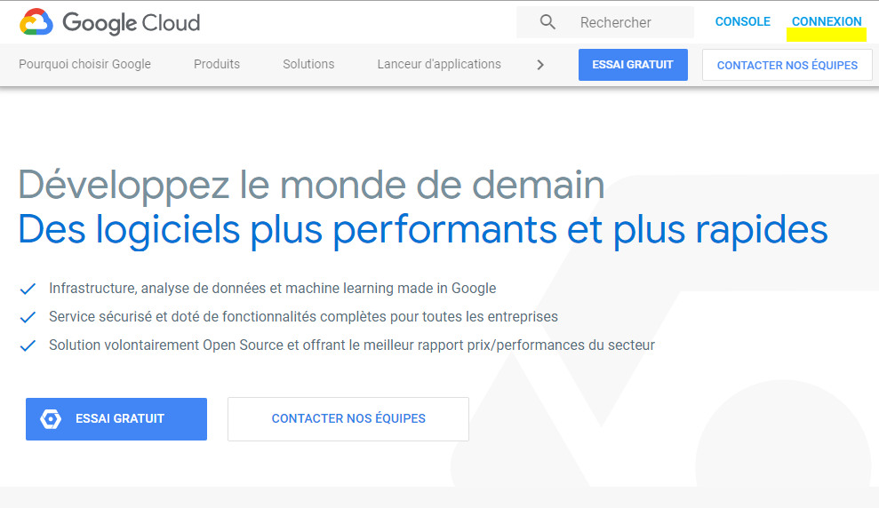

# Connexion Google Cloud
Il faut aller sur le site officiel de google cloud 
https://cloud.google.com/?hl=fr 
## Il faut cliquer sur connexion.

## Après il faut se connecter avec un compte "Gmail" 
## Soit vous sélectionnez un compte que vous avez déjà sinon vous ajoutez un autre compte

 

## Dès qu'on a terminé la sélection du compte en clique sur console comme il est indiqué 

 

## Après on fait la création de notre projet on cliquant sur l'icône qui se trouve à droite de Google cloud platforme

## Ensuite en clique sur l'icône "+"

## En choisi le nom projet en peut aussi changer l'ID du projet et à la fin cliquez sur créer

## En voie après que le projet était créé
## En sélectionne notre projet et en clique sur ouvrir

## Et voilà on est dans notre projet

# Installation de google cloud sur Eclipse 
## Tout d'abord il faut installer Eclipse voilà le lien
https://www.eclipse.org/downloads/
## Après il faut ouvrir le logiciel Eclipse aller sur Help et il faut choisir Eclipse Markplace

## Dans l'endroit " Find" mettez google et après cliquez sur entrer 
## Il va vous apparaisse Google Cloud Tools, cliquer sur Install 

## Après il faut vérifier les préférences on cliquant sur le menu Windows qui se trouve dans la barre d'outil ensuite cliquer sur Preferences
 
## Ensuite recherchez google 

## Voilà le résultat 

## Et maintenant il faut cliquer sur" App Engine Java compnents" après suivez les étapes sur cette page "https://cloud.google.com/sdk/docs/components"où on va installer "Google SDK" au premier temps,  après l'installation il faut se connecter avec le comte Gmail que vous avez créé  

## connectez vous 

## Après il faut choisir le numéro qui correspond a notre projet on va choisir 3 dans ce cas 

## Ensuite on va installer "app-engine-java" en mettant 'gcloud compnents install app-engine-java' après en clique sur entrer 

## En clique sur y après

## Ensuite l'installation peut rester quelques minutes

## A la fin on a ce résultat

## Après si en regarde dans les préférences on va trouver ce résultat, et il faut cocher 'Choose SDK' et 'Share anonymouse' 

# Création de projet Eclipse

 

