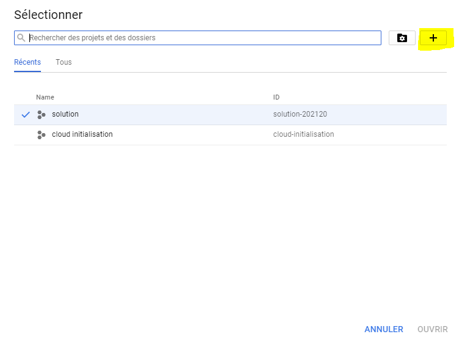

# Connexion Google Cloud
Il faut aller sur le site officiel de google cloud 
https://cloud.google.com/?hl=fr 
## Il faut cliquer sur connexion.

## Après il faut se connecter avec un compte "Gmail" 
## Soit vous selectionnez un compte que vous avez déjà sinon vous ajoutez un autre compte

 

## dès qu'on a terminé la sélection du compte en clique sur console comme il est indiqué 

 

## Après on fait la création de notre projet on cliquant sur l'icône qui se trouve à droite de Google cloud platforme

## Ensuite en clique sur l'icône "+"

## En choisi le nom projet en peut aussi changer l'ID du projet et à la fin cliquez sur créer

## En voie après que le projet était créé
## en sélectinne notre projet et en clique sur ouvrir

## Et voilà on est dans notre projet

# installation de google cloud sur Eclipse 
